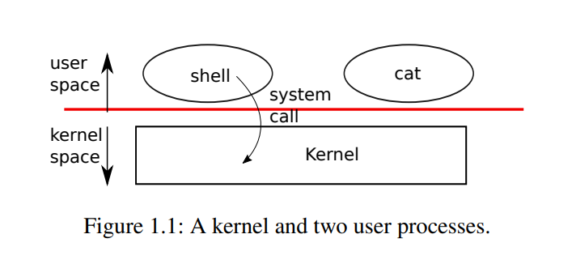

# Chapter 1

## Operator system interfases

+ xv6采用传统的**内核**（ `Kernel` ）形式（内核是一个特殊的程序，为正在运行的程序提供服务）



+ 每个正在运行的程序称为**进程**（ `process` ）
+ 每个进程包含指令、数据和堆栈的内存
  + **指令**实现了程序的运算；
  + **数据**是计算所依赖的变量；
  + **堆栈**组织程序的过程调用；
+ 当一个进程需要调用一个内核服务时，进程首先调用一个系统调用（操作系统接口），系统调用进入内核，内核执行服务并返回，可以看到，进程在用户空间和内核空间交替执行。
+ 内核使用CPU提供的硬件保护机制来确保每个在用户空间执行的进程只能访问它自己的内存。
  + 内核程序的执行拥有操控硬件的权限，它需要实现这些保护；
  + 用户程序则没有这种权限，当用户程序掉用系统调用时，硬件会提升权限级别，并开始执行内核中预先安排好的函数。
+ 内核提供的系统调用集合是用户程序看到的接口。xv6 内核提供了 Unix 内核传统上提供的服务和系统调用的子集，下表列出了 xv6 的所有系统调用，

    | **系统调用**                            | **描述**                                                    |
    | --------------------------------------- | ----------------------------------------------------------- |
    | `int fork()`                            | 创建一个进程，返回子进程的PID                               |
    | `int exit(int status)`                  | 终止当前进程，并将状态报告给wait()函数。无返回              |
    | `int wait(int *status)`                 | 等待一个子进程退出; 将退出状态存入*status; 返回子进程PID。  |
    | `int kill(int pid)`                     | 终止对应PID的进程，返回0，或返回-1表示错误                  |
    | `int getpid()`                          | 返回当前进程的PID                                           |
    | `int sleep(int n)`                      | 暂停n个时钟节拍                                             |
    | `int exec(char *file, char *argv[])`    | 加载一个文件并使用参数执行它; 只有在出错时才返回            |
    | `char *sbrk(int n)`                     | 按n 字节增长进程的内存。返回新内存的开始                    |
    | `int open(char *file, int flags)`       | 打开一个文件；flags表示read/write；返回一个fd（文件描述符） |
    | `int write(int fd, char *buf, int n)`   | 从buf 写n 个字节到文件描述符fd; 返回n                       |
    | `int read(int fd, char *buf, int n)`    | 将n 个字节读入buf；返回读取的字节数；如果文件结束，返回0    |
    | `int close(int fd)`                     | 释放打开的文件fd                                            |
    | `int dup(int fd)`                       | 返回一个新的文件描述符，指向与fd 相同的文件                 |
    | `int pipe(int p[])`                     | 创建一个管道，把read/write文件描述符放在p[0]和p[1]中        |
    | `int chdir(char *dir)`                  | 改变当前的工作目录                                          |
    | `int mkdir(char *dir)`                  | 创建一个新目录                                              |
    | `int mknod(char *file, int, int)`       | 创建一个设备文件                                            |
    | `int fstat(int fd, struct stat *st)`    | 将打开文件fd的信息放入*st                                   |
    | `int stat(char *file, struct stat *st)` | 将指定名称的文件信息放入*st                                 |
    | `int link(char *file1, char *file2)`    | 为文件file1创建另一个名称(file2)                            |
    | `int unlink(char *file)`                | 删除一个文件                                                |

+ 本章的其余部分概述了xv6的服务——进程、内存、文件描述符、管道和文件系统

## 1.1 Processes and memory

+ xv6 进程由用户空间内存（指令、数据和堆栈）和对内核私有的每个进程状态组成。
+ Xv6 分时进程: 它透明地在等待执行的进程集合中切换可用的CPU。当一个进程没有执行时， xv6 保存它的CPU寄存器，并在下一次运行该进程时恢复它们。内核利用进程 id 或 PID 标识每个进程。
+ 一个进程可以使用 `fork` 系统调用创建一个新的进程，称其为子进程。 其**内存内容与父进程完全相同**。 `fork` 在父子进程中都返回值。
  + 在父进程中， `fork` 返回子类的PID；
  + 在子进程中， `fork` 返回零。例如：

    ```C++
    // fork()在父进程中返回子进程的PID
    // 在子进程中返回0
    int pid = fork();
    if(pid > 0) 
    {
        printf("parent: child=%d\n", pid);
        pid = wait((int *) 0);
        printf("child %d is done\n", pid);
    } 
    else if(pid == 0) 
    {
        printf("child: exiting\n");
        exit(0);
    } else 
    {
        printf("fork error\n");
    }

    // 结果：
    // parent: child=1234
    // child: exiting
    // parent: child 1234 is done
    ```

  + `exit` 系统调用导致调用进程停止执行并释放资源（如内存和打开的文件）。
    + `exit` 接受一个整数状态参数，通常0表示成功，1表示失败。
  + `wait` 系统调用返回当前进程的已退出子进程的 PID ，并将子进程的退出状态复制到传递给wait的地址；
    + 如果调用方的子进程都没有退出，那么 `wait` 等待一个子进程退出。
    + 如果调用者没有子进程，wait立即返回-1。
    + 如果父进程不关心子进程的退出状态，它可以传递一个0地址给 `wait` 。
+ 尽管最初子进程与父进程有着相同的内存内容，但是二者在运行时拥有不同的内存空间和寄存器：在一个进程中改变变量不会影响到另一个进程。

## 1.2 I/O and File descriptors

+ 文件描述符，表示进程可以读取或写入的由内核管理的对象。
+ 进程可以通过打开一个文件、目录、设备，或创建一个管道，或复制一个已存在的描述符来获得一个文件描述符。
+ 文件描述符接口将文件、管道和设备之间的差异抽象出来，使它们看起来都像字节流。
+ 在内部， xv6 内核使用文件描述符作为每个进程表的索引，这样每个进程都有一个从零开始的文件描述符的私有空间。
  + 进程从文件描述符0读取（标准输入），
  + 将输出写入文件描述符1（标准输出），
  + 并将错误消息写入文件描述符2（标准错误）。
+ shell 利用这个约定来实现I/O重定向和管道。 shell 确保它始终有三个打开的文件描述符，这是控制台的默认文件描述符。
+ `read` 和 `write` 系统调用以字节为单位读取或写入已打开的以文件描述符命名的文件。
  + `read(fd，buf，n)` 从文件描述符 fd 读取最多 n 字节，将它们复制到 buf ，并返回读取的字节数，引用文件的每个文件描述符都有一个与之关联的偏移量。 `read` 从当前文件偏移量开始读取数据，然后将该偏移量前进所读取的字节数：（也就是说）后续读取将返回第一次读取返回的字节之后的字节。当没有更多的字节可读时， `read` 返回 0 来表示文件的结束。
  + `write(fd，buf，n)` 将 buf 中的n字节写入文件描述符，并返回写入的字节数。只有发生错误时才会写入小于 n 字节的数据。与读一样， `write` 在当前文件偏移量处写入数据，然后将该偏移量向前推进写入的字节数：每个 `write` 从上一个偏移量停止的地方开始写入。
  + `fork` 和 `dup` 复制出的文件描述符共享基础文件偏移量。
+ `close` 系统调用释放一个文件描述符，使其可以被未来使用的 `open` 、 `pipe` 或 `dup` 系统调用重用。**新分配的文件描述符总是当前进程中编号最小的未使用描述符**。
+ 文件描述符是一个强大的抽象，因为它们隐藏了它们所连接的细节：写入文件描述符 1 的进程可能写入文件、设备（如控制台）或管道。

## 1.3 Pipe

+ 管道是作为一对文件描述符公开给进程的小型内核缓冲区，一个用于读取，一个用于写入。将数据写入管道的一端使得这些数据可以从管道的另一端读取。
+ 管道为进程提供了一种通信方式。

    ```C++
    int p[2];
    char *argv[2];
    argv[0] = "wc";
    argv[1] = 0;
    pipe(p);
    if (fork() == 0) 
    {
        close(0);
        dup(p[0]);
        close(p[0]);
        close(p[1]);
        exec("/bin/wc", argv);
    } else 
    {
        close(p[0]);
        write(p[1], "hello world\n", 12);
        close(p[1]);
    }
    ```

+ 管道读写的四种情况
  + 如果一个管道的写端一直在写，而读端的引⽤计数是否⼤于0决定管道是否会堵塞，引用计数大于0，只写不读再次调用write会导致管道堵塞；
  + 如果一个管道的读端一直在读，而写端的引⽤计数是否⼤于0决定管道是否会堵塞，引用计数大于0，只读不写再次调用read会导致管道堵塞；
  + 而当他们的引用计数等于0时，只写不读会导致写端的进程收到一个SIGPIPE信号，导致进程终止，只写不读会导致read返回0,就像读到⽂件末尾⼀样。

## 1.4 File System

+ Xv6 文件系统提供数据文件（包含未解释的字节数组）和目录（包含对数据文件和其他目录的命名引用）。
  + `chdir` ：更改当前工作目录。
  + `mkdir` ：创建目录
  + `mknod` ：创建一个新的设备文件
+ 一个文件的名字和文件本身是不同的;同一个底层文件（叫做 `inode` ，索引结点）可以有多个名字（叫做 `link` ，链接）。
  + `fstat` 系统调用从文件描述符所引用的inode中检索信息。它填充一个 stat 类型的结构体，定义如下：
  
    ```C++
    #define T_DIR 1    // Directory
    #define T_FILE 2   // File
    #define T_DEVICE 3 // Device
    struct stat {
        int dev;     // 文件系统的磁盘设备
        uint ino;    // Inode编号
        short type;  // 文件类型
        short nlink; // 指向文件的链接数
        uint64 size; // 文件字节数
    };
    ```
  + `link` 系统调用创建另一个文件名，该文件名指向与现有文件相同的 `inode` 。
  + `unlink` 系统调用从文件系统中删除一个名称。只有当文件的链接数为零且没有文件描述符引用时，文件的 `inode` 和包含其内容的磁盘空间才会被释放。